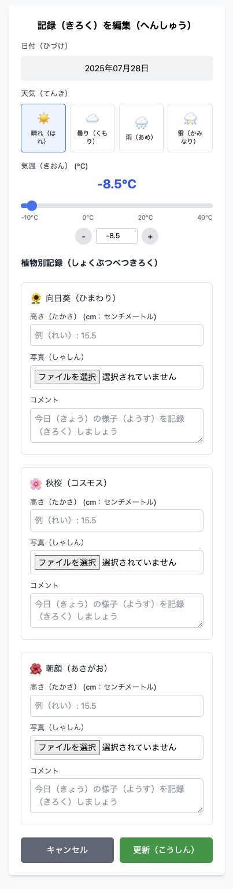

# Plant Growth Tracker

子供の植物成長記録アプリ

## 概要

朝顔、ひまわり、コスモスなどの植物の成長を記録・管理するWebアプリケーションです。

## 機能要件

### 記録機能
- 植物の成長記録を日付ごとに記録
- 記録内容：植物名、成長状況、観察メモ、画像
- 既に当日入力済みの場合は「入力済み」と表示し、編集へのリンクを提供

### 表示機能
- 記録一覧の表示
- グラフによる成長の可視化
- 画像ギャラリー

### 管理機能
- 記録の編集・削除
- 植物の種類管理




## 技術スタック

- **Frontend**: Nuxt 3 + Vue 3 + Tailwind CSS
- **Backend**: FastAPI + SQLAlchemy + SQLAdmin
- **Database**: MySQL 8
- **Storage**: MinIO (S3互換)
- **Infrastructure**: Docker Compose

## 開発環境セットアップ

### 前提条件

- Docker
- Docker Compose

### 起動方法

1. リポジトリをクローン
```bash
git clone <repository-url>
cd plant-growth-tracker
```

2. Docker Composeでサービスを起動
```bash
docker-compose up -d
```

3. サービスの確認
- Frontend: http://localhost:3001
- Backend API: http://localhost:8001
- MinIO Console: http://localhost:9003
- MySQL: localhost:3307

### 認証情報

#### Basic認証（ユーザー画面）
- Username: `plant_user`
- Password: `plant_pass123`

#### 管理画面
- Username: `admin`
- Password: `admin123`

#### MinIO
- Access Key: `minioadmin`
- Secret Key: `minioadmin123`

#### MySQL
- Host: `localhost:3307`
- Database: `plant_tracker`
- Username: `app_user`
- Password: `app_password`

## 開発

### バックエンド開発

```bash
cd backend
pip install -r requirements.txt
uvicorn main:app --reload --host 0.0.0.0 --port 8000
```

### フロントエンド開発

```bash
cd frontend
npm install
npm run dev
```

## API仕様

- Swagger UI: http://localhost:8001/docs
- ReDoc: http://localhost:8001/redoc

## 管理画面

SQLAdminによる自動生成管理画面: http://localhost:8001/admin/